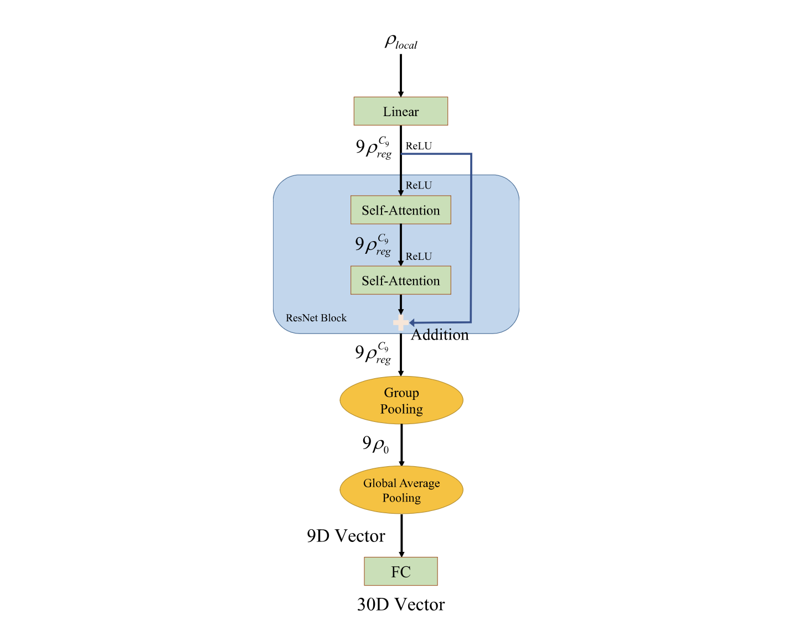
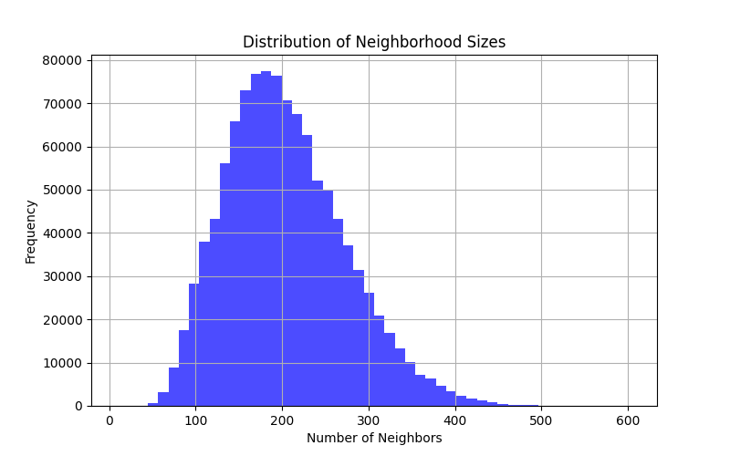
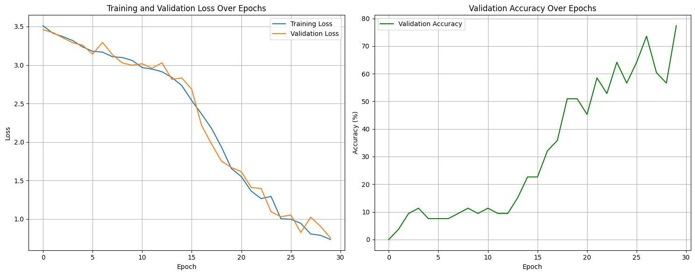

# GETMeshClassier
Gauge equivariant Transformer for classification of various meshes from the SHREC11 dataset
---
This repo collects code that is meant to reproduce the SHREC classification part of the [Gauge Equivariant Transformer paper by He, Dong Wang, Tao, Lin](https://proceedings.neurips.cc/paper/2021/file/e57c6b956a6521b28495f2886ca0977a-Paper.pdf). The dataset is composed of 600 meshes, divided into 30 classes (human, bird, alien, hand, ...) of 20 meshes each.  

The architecture of the Transformer is the one sketched in the [supplementary materials](https://openreview.net/attachment?id=fyL9HD-kImm&name=supplementary_material), that is

The gauge equivariance is enforced via: the equivariance in the LocalToRegular map in the first layer, the equivariance in the Self Attention Block (gauge invariant attention + gauge equivariant value map) and the gauge equviariance in the RegularToRegular multi-head aggregation function. The gauge invariance property is enforced by the last pooling layers: GroupPooling and Global Average Pooling. The pooling blocks output an N-dimensional vector (N is the order of the regular group, see the paper for details) which is mapped via a fully connected layer to a 30-dimensional vector representing class logits.

The gauge invariant attention between vertex $v$ and neighbor $n$ is computed by parallel transporting the feature vector in $n$ to $v$, and then applying a value matrix to the parallel-transported feature. To improve expressibility, the value matrix is dependent on the relative coordinate of neighbor $n$ in $v$'s reference frame. The map must sastisfy equation (15) of the original paper, and special care is dedicated to this goal by using a second order Taylor expansion, solving a consistency equation order by order via SVD and computing linear bases of admissible kernels. 

The preprocessing is done using trimesh's quadric decimation algorithm. This simplifies the original SHREC11 meshes to around 1000 points. Up to 200 neighbors in a radius of sigma=0.2 are selected for each vertex, following insights from the distribution of neighborhood sizes:

I chose to use $2$-heads self attention blocks and learning rate $=1e-2$ whereas for everything else i stuck with the original author's indications (when available). Current best results: 82% test accuracy, probably very increasable with longer learning (70 epochs as indicated by authors vs 30 epochs i used).

